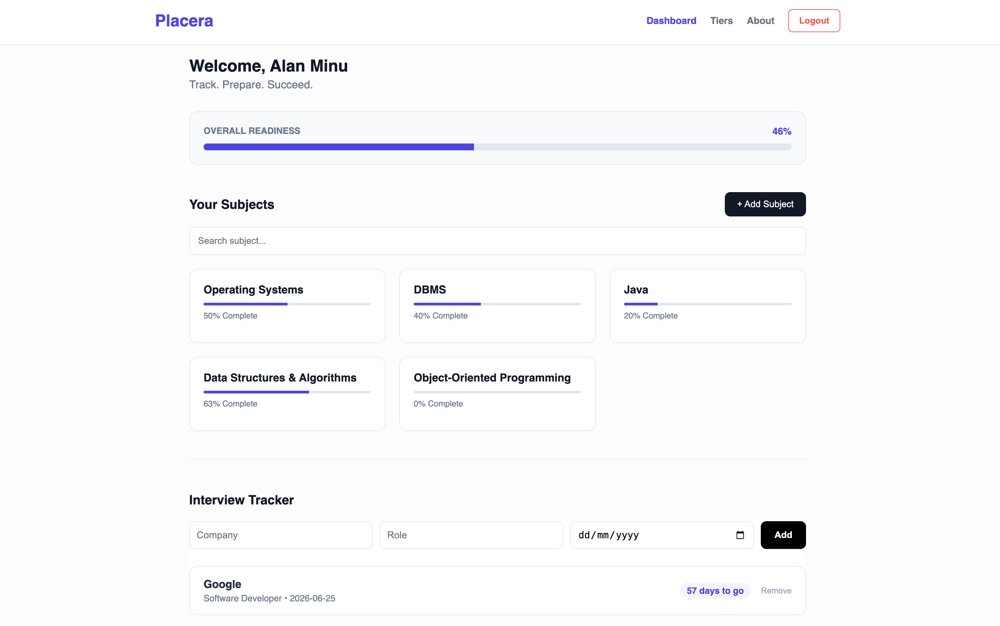
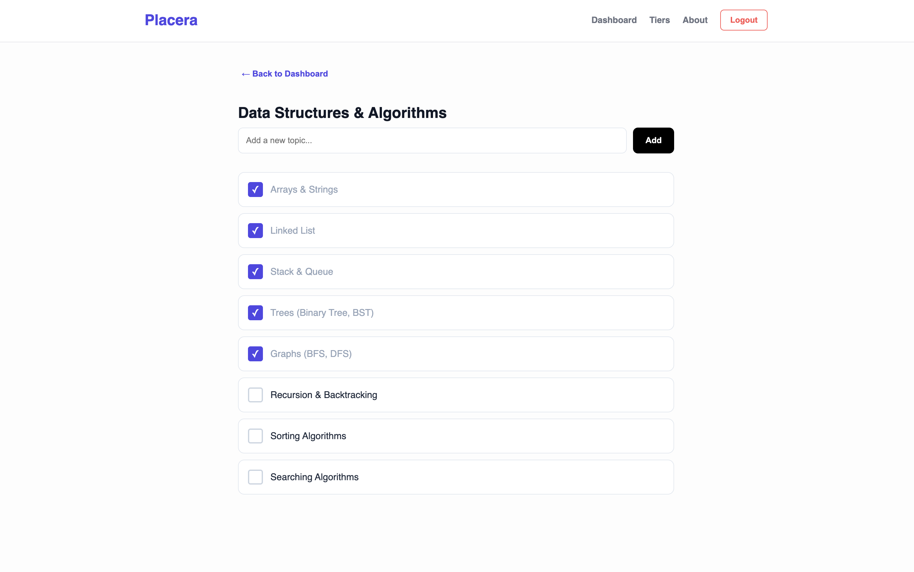
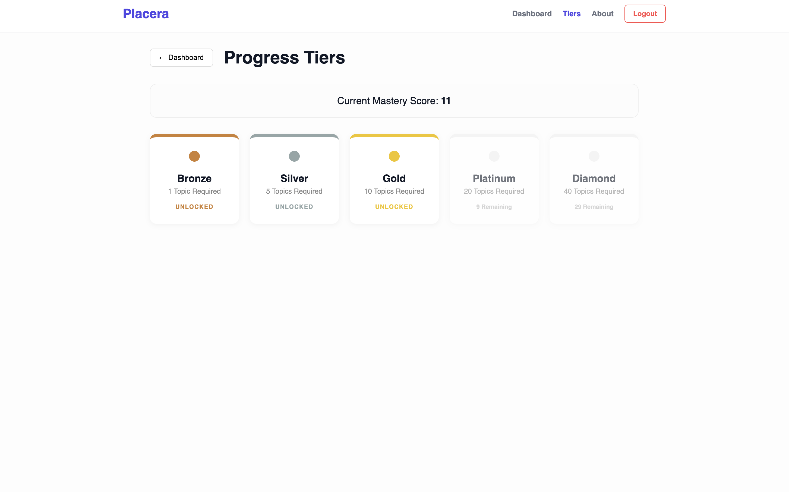

# Placera — Placement Preparation Portal

Placera is a web-based platform designed to help students prepare for placements by tracking subject-wise progress, managing interview experiences, and staying organized throughout the placement journey.

---

## Live Demo

https://placera-placement-portal.vercel.app/

---

## Features

* Dashboard to monitor overall preparation progress
* Subject-wise tracking for structured learning
* Interview tracking integrated into the dashboard
* Badge/achievement system for motivation
* Login interface

---

## Tech Stack

* React (Vite)
* JavaScript
* CSS

---

## Screenshots

### Dashboard


### Subject Detail


### Badges


---

## Project Structure

```
src/
 ├── assets/
 ├── components/
 │    └── InterviewTracker.jsx
 ├── pages/
 │    ├── About.jsx
 │    ├── Badges.jsx
 │    ├── Dashboard.jsx
 │    ├── Login.jsx
 │    └── SubjectDetail.jsx
 ├── App.jsx
 ├── main.jsx
```

---

## Run Locally

Clone the repository and start the development server:

```bash
git clone https://github.com/alanminu/placera-placement-portal.git
cd placera-placement-portal
npm install
npm run dev
```

---

## Future Improvements

* Backend integration 
* Authentication 
* Database integration 
* Analytics dashboard with performance insights
* UI/UX improvements and responsiveness

---

## Author

Alan Minu
https://github.com/alanminu
